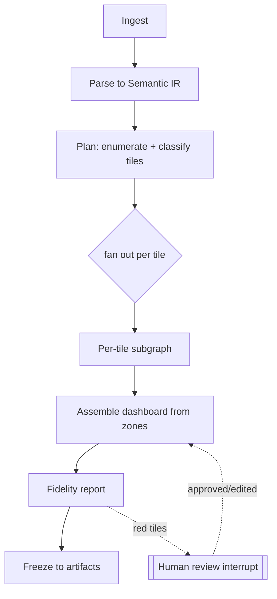
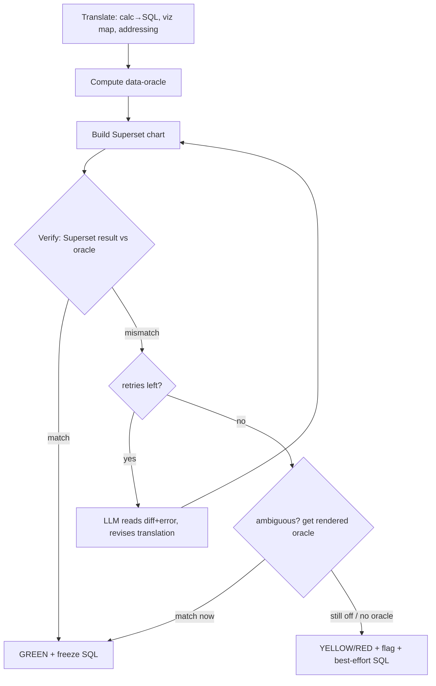

# Migration Buddy — Architecture & Plan

A LangGraph agent that migrates Tableau workbooks to Apache Superset with
**verified fidelity per tile**. Grounded in what we proved by hand: the agent can
self-verify the common case from data, needs a rendered oracle for the ambiguous
20%, and must *flag, never fake*.

---

## 0. North star & non-negotiable principles

1. **Flag, don't fake.** No tile ships a number that wasn't verified against an
   oracle. An unverified tile is *yellow/red*, never silently green.
2. **Data is the first oracle.** Compute ground truth from the `.hyper` extract.
   This covers the median dashboard with zero human input (proven on HR: 6/7
   tiles, all KPIs exact, blind).
3. **Tiered oracle for the rest.** Ambiguous calcs (LOD-in-context, LinPack
   param chains) fall back to Tableau's *rendered* values, then to a human.
4. **Deterministic tools do mechanical work; the LLM does judgment.** The agent
   orchestrates; it does not hand-compute numbers or hallucinate SQL that ships.
5. **Freeze to replayable artifacts.** The agent's decisions compile to
   deterministic SQL + chart specs. Production runs replay the artifacts, killing
   agent non-determinism and giving an audit trail.
6. **The fidelity report is the product.** "X/Y tiles migrated & verified, here
   are the N to review and exactly why" — that's what gets trusted and paid for.

---

## 1. System layers (10,000-ft view)

```
┌──────────────────────────────────────────────────────────────────────┐
│  UI / Review layer   — fidelity report, side-by-side, approve/edit     │
├──────────────────────────────────────────────────────────────────────┤
│  Orchestration       — LangGraph state machine (the agent loop)        │
├──────────────────────────────────────────────────────────────────────┤
│  Tool layer          — parse, resolve-calc, sql-exec, superset-api,    │
│                        data-oracle, tableau-export, diff-engine        │
├──────────────────────────────────────────────────────────────────────┤
│  Semantic IR         — datasources, calcs, worksheets, zones, params   │
├──────────────────────────────────────────────────────────────────────┤
│  Knowledge / memory  — construct catalog, viz-map, eval corpus         │
├──────────────────────────────────────────────────────────────────────┤
│  Targets & sources   — Superset (REST/model), Tableau extract+export   │
└──────────────────────────────────────────────────────────────────────┘
```

On-prem/air-gapped: every layer runs locally. Claude via API (or a local model
slot). Rendered oracle via local Tableau Desktop export — no cloud dependency.

---

## 2. The LangGraph graph (macro)



### Shared state (the graph's memory)
```
MigrationState = {
  workbook:   {path, twb_xml, hyper_frames, params},
  ir:         SemanticIR,                 # parsed model
  plan:       [TilePlan],                 # one per worksheet-on-dashboard
  tiles:      {tile_id -> TileRecord},    # evolving per-tile result + verdict
  oracle:     {tile_id -> ground_truth},  # data/rendered/human values
  budget:     {tokens, tier_calls},       # cost governor
  report:     FidelityReport,
  artifacts:  {sql, chart_specs, dash_spec}
}
```

---

## 3. Per-tile subgraph — the heart (this is where trust is earned)



**Two verification checks, not one:**
- **Numeric diff** — Superset's own query result vs the oracle, within tolerance.
- **Structural diff** — does the built tile's *field + shape* match the `.twb`
  shelf spec? (This is the check that catches the "used `CF_age band` instead of
  `Age(bin)`" slip. The agent's tile said one field; the shelf said another.)

The **Fix** node is the reason an agent beats a static script: it reads the actual
error/diff and reasons out the correction, instead of needing a pre-coded pass.

---

## 4. Oracle & verdict engine (the trust core)

| Tier | Source | Cost | Covers |
|---|---|---|---|
| 0 | **Data-oracle** — compute from `.hyper` (pandas/DuckDB) | free | common case (~70-80% of tiles) |
| 1 | **Rendered-oracle** — Tableau crosstab export / VizQL Data Service / headless | some | ambiguous calcs (LOD-in-context, param chains) |
| 2 | **Human confirm** | manual | the irreducible residual |

Verdict = `GREEN` (numeric+structural match), `YELLOW` (renders, structurally
matches, but unverified or closest-match viz), `RED` (no equivalent / diff fails /
needs manual). Every verdict carries: expected, got, diff, the SQL, and the reason.

---

## 5. Tool layer (deterministic; the agent calls these)

Most of these already exist from the spike — they become tools:

- `twbx_unpack`, `twb_parse` → Semantic IR
- `hyper_read` → dataframes (data-oracle source)
- `calc_resolve` → the resolver passes: params, string/date fns, `FIXED-LOD→window`,
  `table-calc→window`, quick-calcs. Returns SQL + a *hardness* flag.
- `data_oracle(query_spec)` → ground-truth value from the extract
- `superset.{create_dataset, add_metric, add_calc_col, create_chart, create_dashboard, run_query}`
- `tableau_export(sheet)` → rendered-oracle values (Tier 1)
- `diff_engine(expected, got, kind)` → numeric + structural verdict
- `layout_from_zones(dashboard)` → Superset grid

The LLM never emits a shipped number; it emits **translations and choices** that
tools execute and the verdict engine gates.

---

## 6. Knowledge / memory — the flywheel (the real moat)

- **Construct catalog**: every calc pattern → its *verified* SQL translation.
  Grows per workbook; next migration reuses it. This is defensibility, not the code.
- **Viz-mapping table**: Tableau mark/shelf shape → Superset viz_type, learned +
  curated (pie→pie, Square→heatmap, cum:sum→line, funnel-pattern→funnel).
- **Eval corpus**: workbook + expected outputs → regression suite. Every new
  dashboard we handle becomes a permanent test. This is how we measure "% auto-
  verified" and prevent regressions.

---

## 7. Human-in-the-loop

LangGraph `interrupt` at three points:
1. **Red-tile review** — reviewer sees side-by-side + diff + SQL, approves/edits.
   Edits feed the construct catalog (the flywheel learns).
2. **Ambiguous-calc decision** — when Tier-0 underdetermines and Tier-1 is
   unavailable, ask the human which interpretation.
3. **Oracle-access / side-effect approval** — before hitting Tableau export or
   writing to a shared Superset.

The reviewer's touch-points are the *only* manual work — everything green flows
through untouched.

---

## 8. Honest failure modes & mitigations

| Failure | Mitigation |
|---|---|
| Ambiguous calc, data underdetermines | Tier-1 rendered oracle → else human interrupt |
| No Superset equivalent (viz extension) | closest-match + RED flag, never fake |
| Agent hallucinates SQL | verify gate: unverified never ships (worst case = YELLOW) |
| Non-determinism run-to-run | freeze to artifacts; production replays deterministically |
| Rendered oracle unavailable (air-gapped, no Tableau) | degrade to data-oracle + flag; report coverage honestly |
| Cost blowup on huge workbooks | budget governor in state; cheap model for mechanical nodes |

---

## 9. Model routing (cost/quality)

- **Mechanical nodes** (ingest, structural checks, layout): no LLM or a small model.
- **Translate / Fix / Plan**: strong model (the judgment nodes).
- Escalate model tier only on retry (cheap first attempt, smarter retry).

---

## 10. Build roadmap (phased, each shippable)

- **Phase 0 — Harness (mostly done).** IR + `calc_resolve` + data-oracle + diff
  engine + Superset tools. Deterministic, tested.
- **Phase 1 — Single-tile loop.** Translate→build→verify→retry on one tile, with
  numeric + structural diff. Prove the loop self-corrects the `Age(bin)`-type slip.
- **Phase 2 — Full dashboard graph.** Fan-out per tile, assemble from zones,
  emit fidelity report. Freeze artifacts.
- **Phase 3 — Tier-1 rendered oracle.** Tableau export integration; escalation path.
- **Phase 4 — Flywheel.** Construct catalog + eval corpus + regression harness.
  Now measure "% auto-verified" across a real corpus — the go/no-go number.
- **Phase 5 — Review UI + replay.** Fidelity report UI, HITL interrupts,
  deterministic replay for production migrations.

**Gate after Phase 4:** run 15-20 real dashboards. ≥75% tiles auto-verified on
median dashboards → build the business. Much lower → it's a consulting tool.

---

## 11. Stack

- **Orchestration**: LangGraph (Python), checkpointer for resumable state + HITL.
- **Reasoning**: Claude (Sonnet for mechanical/cheap nodes, Opus for hard judgment).
- **Tools**: the spike's `engine.py` resolver → tool functions; pandas/DuckDB for
  data-oracle; Superset REST/model API; Tableau Desktop export (or VizQL Data
  Service) for rendered oracle.
- **Artifacts**: JSON chart/dashboard specs + SQL, versioned per workbook.
- **Target**: Superset (works today via app-context model API; REST for prod).

---

## 12. One-line summary

**Agent + deterministic tools + tiered oracle + verify-retry loop + freeze-to-
artifacts + honest fidelity report.** The agent raises coverage; the verify gate
guarantees trust; the flywheel builds the moat; the report is what sells.
