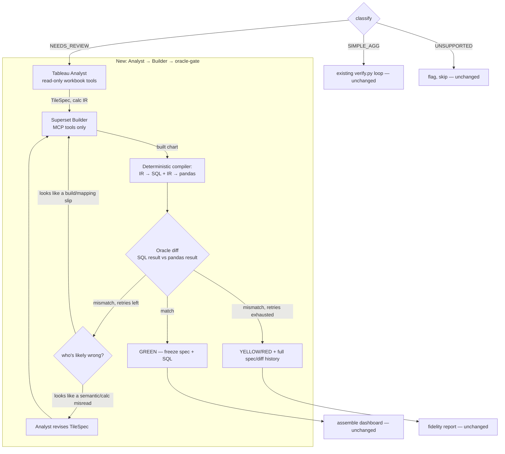

# Migration Buddy — Multi-Agent Extension (Tableau Analyst + Superset Builder)

Companion to [`MIGRATION_BUDDY_ARCHITECTURE.md`](MIGRATION_BUDDY_ARCHITECTURE.md) — this
doc extends that architecture's Section 3 ("Per-tile subgraph — the heart") for the
tiles the current deterministic pipeline can't reach: calc fields, table calcs, LOD
expressions, parameter-driven metric switchers. It does not replace anything in the
existing doc — principle #1, **flag, don't fake**, is unchanged and non-negotiable.

---

## 0. What prompted this

Every real workbook tested this session (HRAnalytics, OverviewDashboard,
MerchandiseSales, Superstore) has a `SIMPLE_AGG` fast path that works well — and a
`NEEDS_REVIEW` bucket (calc-field measures, table calcs, LOD) that today is just
flagged and skipped. MerchandiseSales is the extreme case: **0 of 18 tiles**
translatable, because nearly every measure runs through a calc field like

```
Calculation_254383022497943554 =
  CASE [Parameters].[Parameter 1]
    WHEN 1 THEN [Quantity]*[Sales Price]
    WHEN 2 THEN [Quantity]
    WHEN 3 THEN [Total Sales]
  END
```

`tableau_parse.py`'s regex-based `classify()` correctly recognizes this is out of
scope — it was never designed to understand calc semantics. An LLM that's seen
thousands of Tableau calc patterns can. The question is how to add that without
weakening the one property this whole system is built around: **a GREEN verdict
means the SQL was numerically verified against the workbook's own extract data,
not "an expert felt confident."**

---

## 1. The proposal, and the one change to it

Original framing: a **Tableau Expert** agent summarizes/evaluates, a **Superset
Builder** agent implements, and the Tableau Expert verifies the Builder's output is
"a one-to-one copy."

The split is right. Making the same agent the evaluator is not — for two concrete
reasons, not just principle:

1. **Self-evaluation bias.** The evaluator would judge the implementation against
   its *own* earlier reading of the calc semantics. If that reading was subtly
   wrong, the evaluator has no independent signal to catch it — it's checking
   against its own mental model, not against the extract data.
2. **A plausibility judgment is not a verification.** The existing pipeline's
   trust comes from a mechanical diff: SQL result vs. pandas-computed oracle,
   both derived from the same extract. That can't be talked into being wrong. An
   LLM verdict — however expert — can be fooled by a chart that's the right
   shape with subtly wrong numbers, which is exactly the failure mode a numeric
   diff exists to catch.

**The fix that keeps both**: the Analyst doesn't emit SQL or pandas code directly.
It emits a small **declarative calc IR** — and a deterministic compiler (not an
LLM) turns that *one* IR into both the SQL sent to Superset and the pandas
computation used as the oracle. The two can never silently diverge, because
they're compiled from the same source by the same non-agentic code. This is the
same trick `verify.py` already uses for bin/categorical-bin fields (one spec →
`_bin_sql_expr` and `_synthetic_dim_key`) — this proposal generalizes it to
arbitrary calc-field logic instead of inventing a new trust mechanism.

The Analyst can still be *asked* to look at a mismatch and suggest a fix — that's
valuable, it's what the existing doc's "Fix" node already does. It just never gets
to unilaterally promote a tile to GREEN. Only a passing oracle diff does.

---

## 2. Where this plugs into the existing pipeline

Nothing changes for the ~70-80% of tiles that already work:

```
classify() → SIMPLE_AGG  → existing deterministic verify.py loop (unchanged, free, fast)
           → NEEDS_REVIEW → NEW: Analyst → Builder → oracle-gate subgraph (this doc)
           → UNSUPPORTED  → flagged, skipped (unchanged — no Superset equivalent exists)
```

The new subgraph is strictly additive: it's what happens to tiles that are
*currently* dropped on the floor. If it fails, the tile ends up exactly where it
is today — YELLOW/RED with a reason. It can only improve the GREEN count, never
regress the existing fast path.

---

## 3. The two agents

### Tableau Analyst — read-only, Tableau-side

**Job**: given one `NEEDS_REVIEW` tile, produce a `TileSpec` — a structured,
declarative description of what the tile computes, in the calc IR (§4) — not SQL,
not pandas code.

**Tools** (all read-only, no Superset/MCP access — this boundary is what makes the
"self-evaluation" problem structurally impossible, not just discouraged):
- `get_worksheet_shelves(tile)` — rows/cols/detail/filter shelf contents (already
  exposed via `tableau_parse.py`'s `shelf_dims`/`worksheet_measures`/`detail_dims`)
- `resolve_calc_chain(calc_id)` — the calc's formula plus every calc it references,
  recursively (a parameter-switcher like `Calculation_254383022497943554` above
  references 3 more calcs and a parameter — the Analyst needs the whole chain, not
  just the top formula)
- `get_parameter_value(param_id)` — current parameter value (bin fields already do
  this via `_parameter_value`; same primitive)
- `sample_extract_rows(cols, n=20)` — real rows from the `.hyper` extract, so the
  Analyst is grounded in actual data shape, not guessing from the formula alone

**Input**: the tile's `reason` string from `classify()` (why it's NEEDS_REVIEW),
the full calc chain, a data sample.
**Output**: `TileSpec` (§4) + a confidence note + which parts of the formula it
wasn't sure about (surfaces uncertainty instead of hiding it).

### Superset Builder — write-side, Superset-side

**Job**: given a `TileSpec`, build the actual chart via the existing MCP tools —
`create_dataset_from_data`, `create_virtual_dataset` (for materializing computed
columns, same pattern the bin/group fix already uses), `generate_chart`,
`generate_dashboard`.

**Tools**: exactly `apply.py`'s existing MCP surface. Nothing new here — the
Builder's job is mechanically identical to what `apply.py` does for `SIMPLE_AGG`
tiles today, just driven by a richer spec instead of a plain `ChartPlan`.

**Never sees**: the raw Tableau XML, the calc formulas, or the workbook at all.
It only knows the `TileSpec`. This isn't just tidiness — it's what makes "the
Builder implemented the spec correctly, the spec was wrong" a diagnosable,
separate failure mode from "the Builder misread the spec," instead of one
tangled agent that could fail for either reason and not know which.

---

## 4. The calc IR — why the oracle gate still means something

A `TileSpec`'s metrics/dims are not SQL strings. They're a small expression tree
the Analyst builds out of a fixed, deterministic-compiler-supported vocabulary:

```python
# Illustrative — not final syntax
TileSpec = {
    "viz_type": "bar",
    "dims": [{"col": "Product Category"}],
    "metrics": [
        {
            "label": "Metrics Selected",
            "expr": {
                "op": "case",
                "on": {"op": "param", "name": "Parameter 1"},
                "when": [
                    (1, {"op": "mul", "args": [{"op": "col", "name": "Quantity"},
                                                {"op": "col", "name": "Sales Price"}]}),
                    (2, {"op": "col", "name": "Quantity"}),
                    (3, {"op": "col", "name": "Total Sales"}),
                ],
            },
            "agg": "Sum",
        }
    ],
    "filters": [...],
}
```

A deterministic compiler (plain Python, no LLM, lives next to `_bin_sql_expr` in
`verify.py`) walks this tree twice:
- once to emit a SQL expression for the real chart / `create_virtual_dataset`
- once to emit an equivalent pandas computation for the oracle

If the Analyst's IR is wrong (misread the formula), **both** outputs are wrong the
*same* way — the oracle diff won't catch a spec-level misunderstanding, only an
implementation-level one. That's an honest, named limitation (§7), not swept under
the rug — but it's the same limitation the current human-written translation code
already has (a bug in `_bin_sql_expr` would corrupt both sides too). What the IR
buys us is ruling out an entirely different, larger failure mode: the SQL and the
oracle silently disagreeing because two independent free-text generations (one
LLM-authored SQL string, one LLM-authored pandas snippet) drifted apart. That
failure mode is real — it's exactly what an LLM asked to "write SQL and also write
the equivalent pandas" would risk, and it would be *invisible to the diff itself*
since both sides came from the same confused source.

The compiler only needs to support the operators actually seen in real workbooks —
start narrow (`case`/`param`/arithmetic/column-ref, enough for the parameter-
switcher pattern above) and grow it per the construct catalog (§6), not
speculatively.

---

## 5. Full flow



Retry budget mirrors the existing doc's philosophy (§9 there): 1-2 cheap Builder
retries first (most failures are "wrong column name" / API-shape mismatches, same
category as this session's `sql_expression`-on-dimension discovery), escalate to
an Analyst spec revision only if the Builder retry doesn't close the gap.

---

## 6. Cost control — this is the construct catalog, not a new idea

The existing architecture doc's Section 6 already names the moat: a **construct
catalog** mapping calc patterns → verified translations, reused across workbooks.
This proposal doesn't add a new concept, it gives the catalog a concrete key: a
hash of the resolved calc chain (formula text + referenced calc formulas + param
names, not values). Cache `TileSpec` by that hash.

Effect: the *first* time any workbook uses a 3-way parameter-switcher pattern, the
Analyst runs once. Every subsequent tile — same workbook or a different one — with
the same calc-chain hash reuses the cached `TileSpec` and goes straight to the
Builder. Given how repetitive real dashboards are (MerchandiseSales alone reuses
`Calculation_254383022497943554` across 4+ tiles), this is likely the single
biggest cost lever, more than model routing.

---

## 7. Honest limitations (additions to the existing doc's §8 table)

| Failure | Mitigation |
|---|---|
| Analyst misreads calc semantics; IR is wrong in a way the compiler faithfully preserves on both sides | Oracle diff can't catch this class by construction (§4) — mitigate with the confidence/uncertainty note the Analyst must emit, escalate low-confidence specs to human review rather than attempting silently |
| Calc pattern needs an IR operator that doesn't exist yet | Analyst reports "can't express this," tile stays NEEDS_REVIEW — same honest-failure shape as today, not a crash |
| Builder retry loop thrashes (spec is fine, Builder keeps mis-mapping) | Same retry budget/escalation as the existing Fix node; cap total attempts, fall to YELLOW/RED with the paper trail |
| Construct-catalog cache hit on a superficially-similar but actually-different calc | Hash the full resolved chain (not just the top formula) so a param name/formula text change invalidates the cache entry |

---

## 8. Implementation phasing

- **Phase A — the IR + compiler, proven on one real case.** No agents yet. Hand-
  write the `TileSpec` for MerchandiseSales' `Calculation_254383022497943554`
  (already fully understood from this session's RCA), compile it to SQL + pandas,
  confirm the oracle diff passes against the real extract. This is the load-
  bearing piece — get it right before any agent writes to it.
- **Phase B — Tableau Analyst agent.** Prompt + read-only tools, emitting IR for
  that same known-good case first (compare against the hand-written Phase A spec),
  then a handful more NEEDS_REVIEW tiles from the 4 workbooks already on hand.
- **Phase C — Superset Builder agent.** Prompt + existing MCP tools, consuming
  Phase B's specs.
- **Phase D — wire into `migration_graph.py`.** The NEEDS_REVIEW branch in §5,
  parallel to the untouched SIMPLE_AGG path, with retry/escalation and the
  construct-catalog cache.
- **Phase E — expand the eval corpus.** Same 4 workbooks, now measuring
  NEEDS_REVIEW → GREEN conversion rate as the go/no-go signal, matching the
  existing doc's Phase 4 gate philosophy (≥75% auto-verified).

Each phase is independently shippable and the pipeline degrades gracefully at
every step — a workbook migrated with only Phase A done behaves identically to
today.
